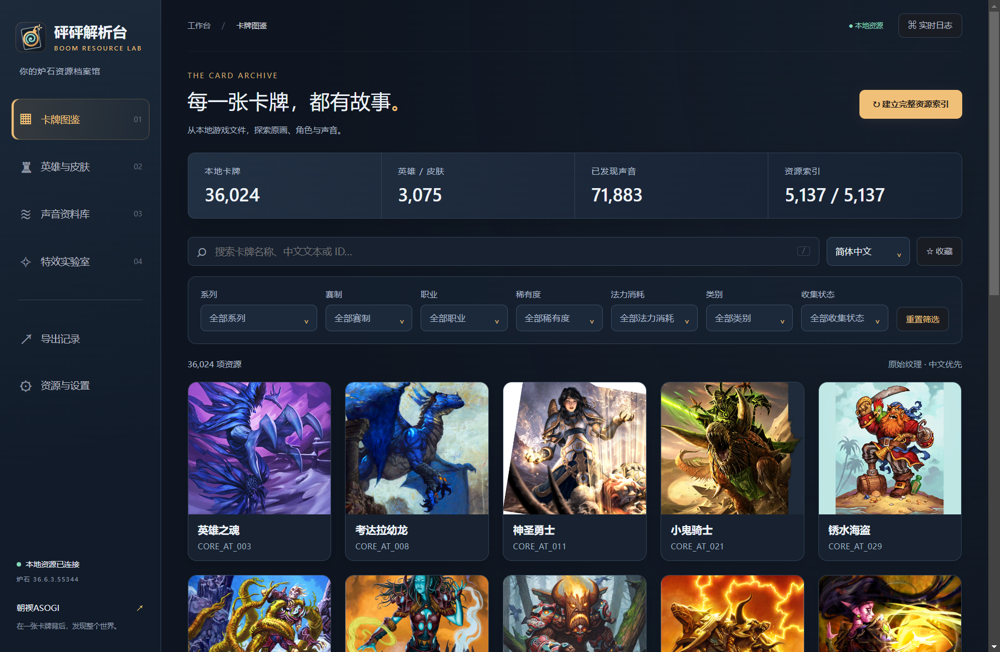
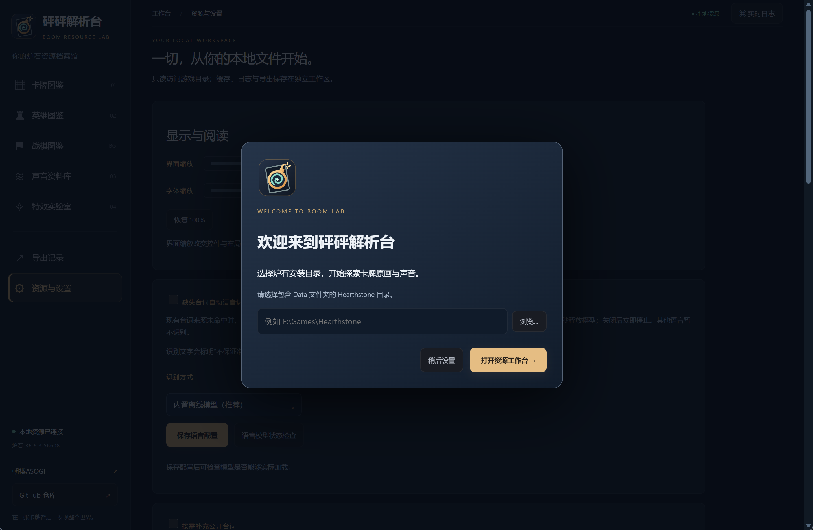
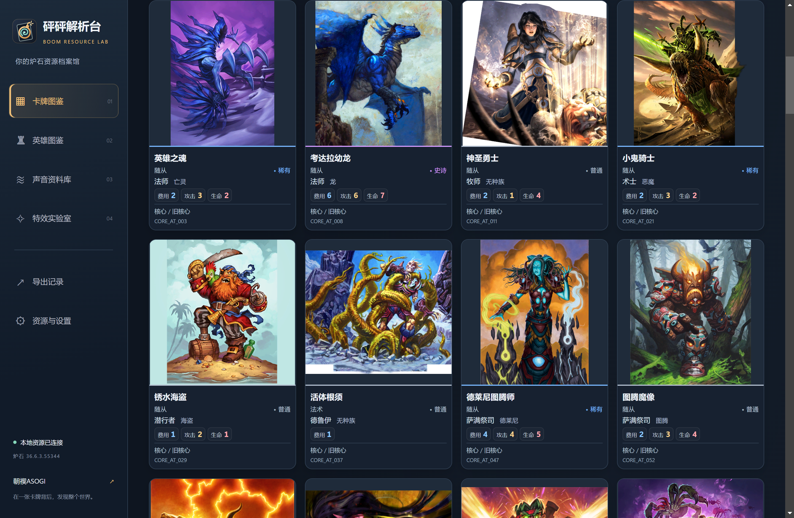
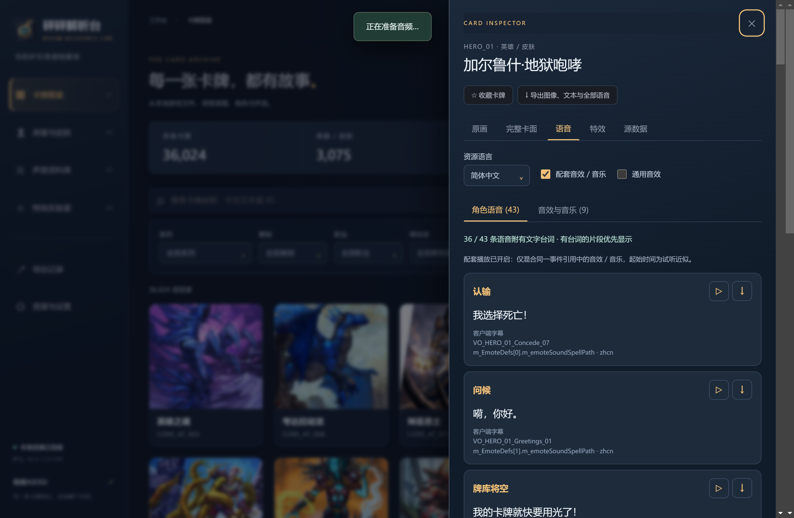
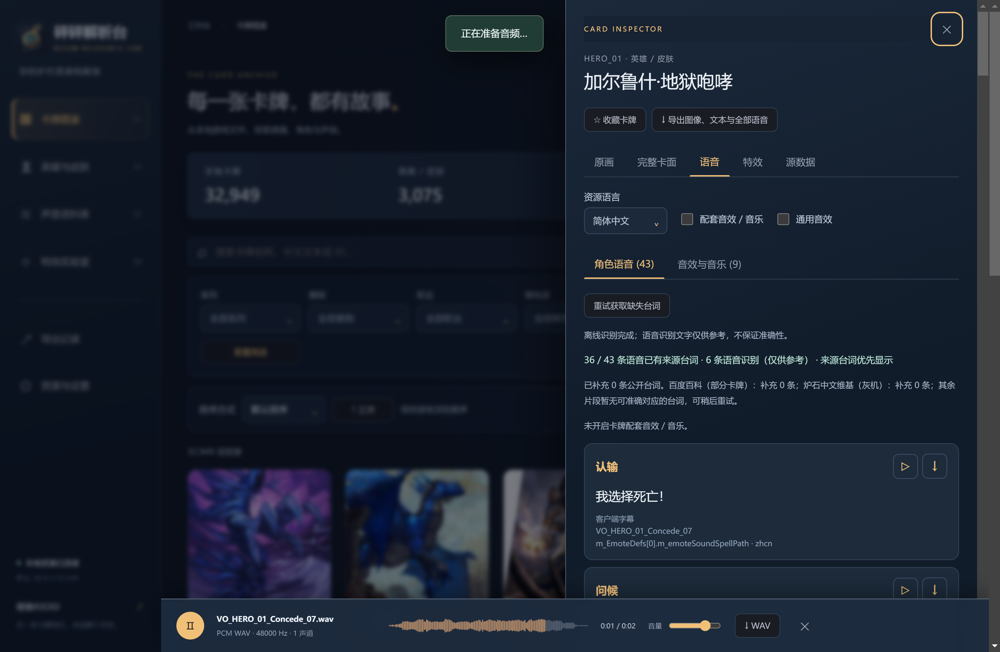
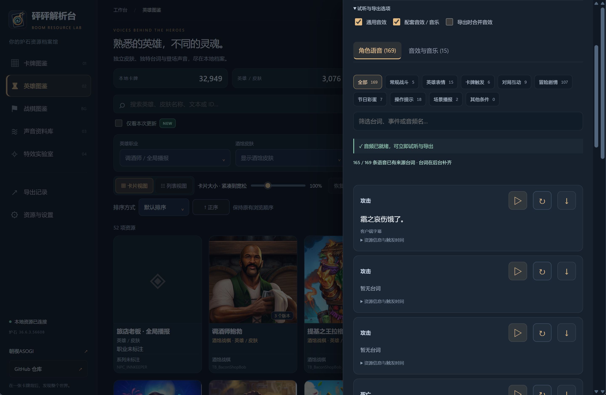
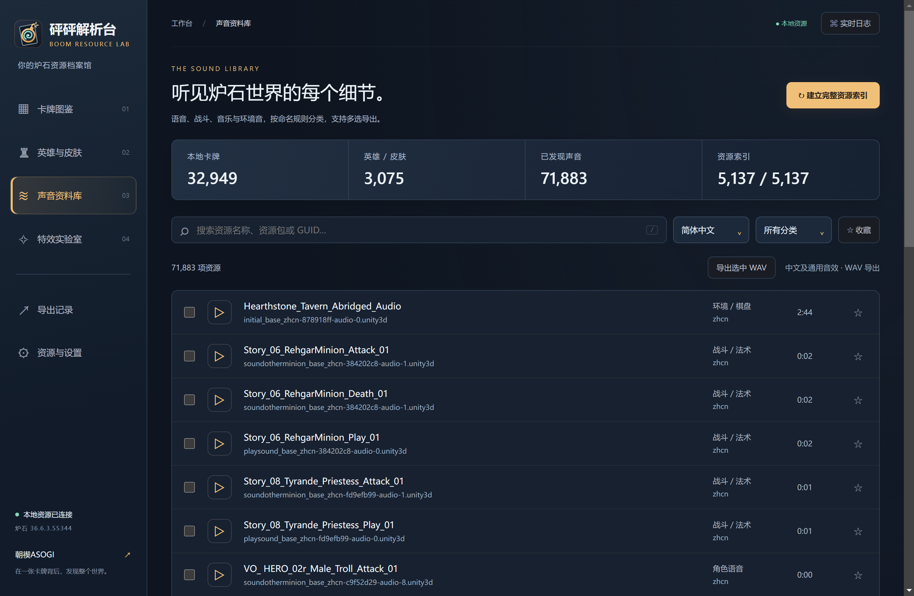
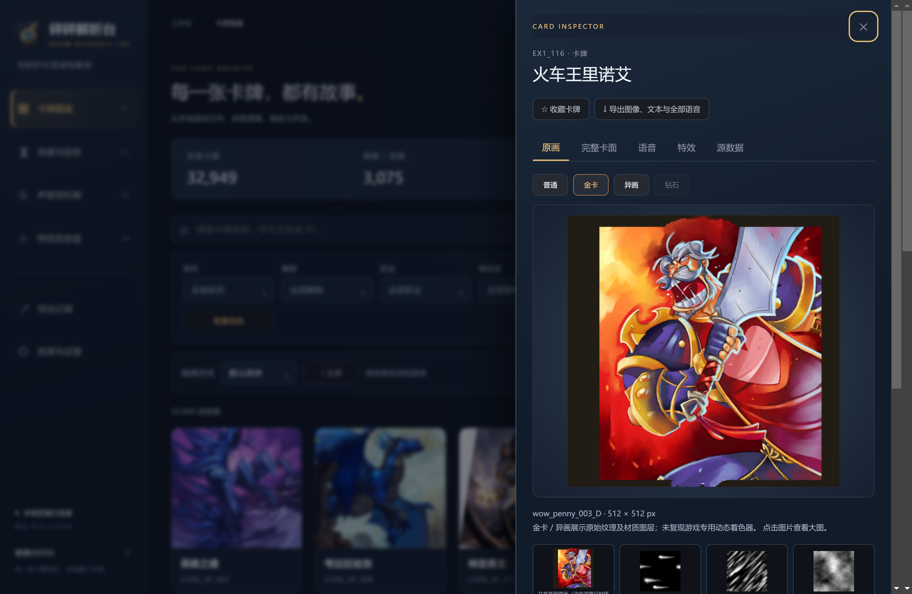
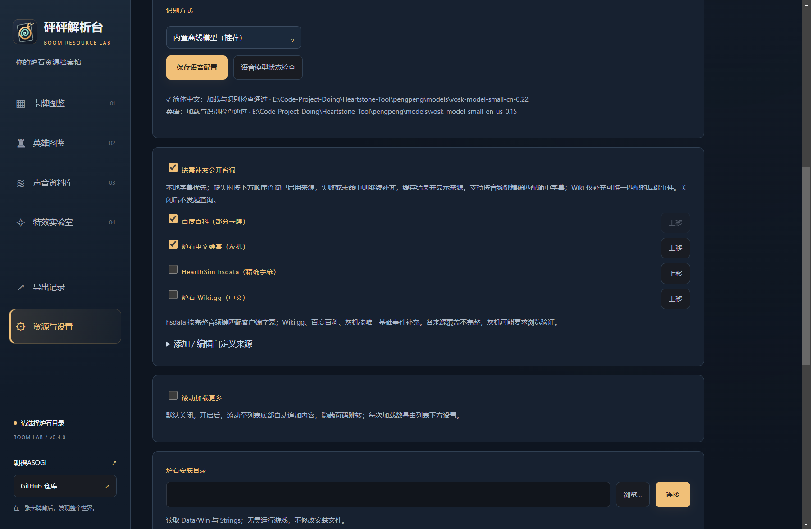
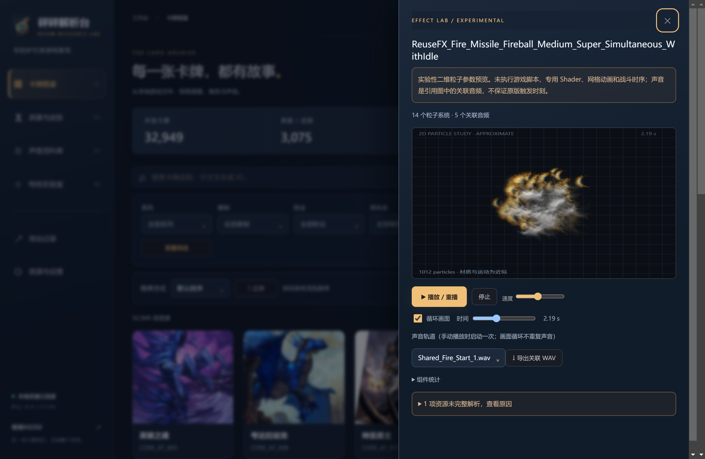

# 砰砰解析台 · Hearthstone Resource Lab

**快速找到一张卡，听见它的声音。**

砰砰解析台是一个面向 Windows 的炉石传说本地资源浏览工具。它把卡牌、英雄皮肤、原画与声音整理成可搜索、可预览的桌面工作台，无需启动游戏即可探索本机已有资源。

> 开发这个工具的初衷，是想快速寻找并试听各种卡牌的语音。目前炉石的各大站点在语音这方面用起来都不是特别方便，于是做了一个本地即开即用的资源预览工具，来随时寻找各种卡牌的语音，也方便自己收集素材（每回合翻面！）

[v0.4.0 更新说明](https://github.com/AsaMisogi/Heartstone-Tool-Resource-Lab/releases/tag/v0.4.0) · [快速开始](#快速开始) · [功能与截图](#功能与截图) · [常见问题](#常见问题) · [许可与使用边界](#许可与使用边界)



## 能做什么

| 功能 | 你可以做的事 |
| --- | --- |
| 卡牌图鉴 | 按名称、文本、ID 搜索，组合系列、赛制、职业、稀有度、费用等筛选，查看详情与关联卡牌 |
| 卡牌与英雄语音 | 按登场、攻击、死亡、问候等事件寻找声音，切换本地语言包，逐条试听、收藏与导出 WAV |
| 台词辅助 | 优先显示客户端字幕；可按需补充公开来源；缺失时用本地语音识别辅助理解 |
| 声音资料库 | 建立完整索引，检索语音、音乐、界面、环境及战斗音效，支持多选导出 |
| 原画与纹理 | 浏览普通、金卡、异画等已有资源，查看材质图层、大图并导出 PNG |
| 特效实验室 | 检查预制体组件、粒子参数与关联声音，进行实验性的二维粒子预览 |
| 工作区管理 | 收藏、筛选记忆、导出记录、可暂停索引、资源诊断和实时日志 |

特色是**从卡牌直接找到声音**：不用手动翻找资源包或猜测音频文件名。角色语音与音效分栏，配套音效／音乐、通用音效可以独立开关；也可以把勾选的配套声音合并导出。解析结果在本机缓存，再次浏览无需从头扫描。

## 快速开始

### 免安装版（推荐）

从 [Releases](https://github.com/AsaMisogi/Heartstone-Tool-Resource-Lab/releases) 下载维护者上传的 Windows x64 便携 ZIP，**完整解压**后双击 `砰砰解析台.exe`。Python、Qt 与解析运行库已随包提供，无需安装 Python、uv 或 Node.js；请保留同目录的 `_internal` 文件夹。需要 Windows 10 / 11 64 位和本机炉石客户端。设置及缓存保存在 EXE 旁的 `workspace/`。

本地资源功能可离线使用；在线卡面、公开台词及可选在线语音 API 需要联网。以下为源码运行方式。

### 1. 准备环境

- Windows 10 / 11，64 位。
- 已合法安装并下载完整的炉石传说客户端，以及想试听的语言包。
- **Python 3.12（64 位，安装时包含 Python Launcher）或已加入 PATH 的 uv**，二选一。
- 首次安装需要联网，项目目录需要可写。无需安装 Node.js，也不需要手动构建前端。

**Code → Download ZIP 下载的是源码**：启动脚本会自动建立隔离环境并安装锁定依赖。免安装包请从 Releases 下载；仓库不附带游戏素材或 Python 环境。

### 2. 下载并启动

在仓库页面点击 **Code → Download ZIP**，完整解压到可写目录，然后双击：

```text
启动砰砰解析台.bat
```

英文入口是 `Start-PengPengWorkbench.bat`。首次安装依赖时请等待控制台完成，之后会打开桌面窗口；后续启动直接复用环境。

也可以使用 Git：

```powershell
git clone https://github.com/AsaMisogi/Heartstone-Tool-Resource-Lab.git
cd Heartstone-Tool-Resource-Lab
.\Start-PengPengWorkbench.bat
```

### 3. 连接炉石目录

选择**包含 `Data` 文件夹的 `Hearthstone` 根目录**，不要选到 `Data/Win` 子目录。工具读取本地游戏文件，设置、缓存与日志写入工具自己的 `workspace/`。



### 4. 试听第一条语音

1. 在“卡牌图鉴”搜索卡名，例如“火车王里诺艾”。
2. 点击卡牌，在详情中打开“语音”。
3. 选择已安装的资源语言，点击对应事件右侧的播放按钮。
4. 按需开启配套音效；点击下载按钮导出 WAV。

想探索不属于某张卡的音乐、棋盘环境声或界面音效，请进入“声音资料库”，先点击右上角 **建立完整资源索引**。扫描耗时取决于资源规模和磁盘速度，可暂停后继续。首次连接会弹窗介绍索引，可暂不建立；卡牌语音采用按块读取，无需先扫描全部资源。

## 功能与截图

以下为项目现有真实运行／界面验证截图，展示不同开发阶段的界面；数量、布局与可用资源以当前版本和本机安装内容为准。截图仅用于说明软件操作，其中的游戏画面、台词与商标仍属于各自权利人。

### 卡牌搜索与英雄皮肤语音

图鉴支持组合筛选、卡片／列表浏览及收藏。英雄按具体皮肤的资源引用解析语音，便于比较同一角色不同皮肤的声音。





### 试听、波形与导出

播放器支持暂停、音量调节与波形定位。声音可逐条导出，也可以导出全部角色语音；输出为解码后的 PCM WAV。导出支持中文命名，并提供打开目录入口。





### 全局声音资料库

完整索引会检索本机资源中的 AudioClip。按资源名称、资源包或 GUID 查找，再通过语言、分类与收藏缩小范围；也可以多选批量导出。分类来自命名规则，可能存在归类不准确的资源。



### 原画、金卡与材质图层

查看资源实际提供的原画和纹理；点击图片放大，按原始尺寸导出 PNG。金卡、异画页展示原始纹理与材质图层，尚未复现游戏的专用动态 Shader。



“完整卡面”按需从 HearthstoneJSON 获取普通成品卡图，**需要联网**，并非本地卡框合成或高清原画；图源版本可能与本机补丁不同。

### 台词补充与离线识别

在“资源与设置”中调整公开台词来源的开关和顺序，也可以添加自定义接口。本地字幕、公开来源与机器识别会区分标注。

缺失台词自动识别支持简体中文和英语短语音。免安装版内置中英文 Vosk 模型，首次使用无需下载；可在设置中检查模型、改用自定义 Vosk 目录或在线语音 API。默认离线模式不上传音频；在线模式按配置发送待识别音频。机器识别可能出错，不能当作官方字幕。详见 [识别说明](docs/SPEECH_RECOGNITION.md)。



### 特效实验室

检索预制体，查看组件统计、粒子参数和关联声音，控制播放速度与时间位置。当前仅提供实验性的二维粒子参数预览，未执行游戏脚本、网格动画、专用 Shader 和战斗逻辑；画面与声音触发时序不等同于游戏内表现。未完整解析的资源会显示原因。



## 常见问题

**双击后启动失败？** 免安装版请确认已完整解压，EXE 旁保留 `_internal`，并查看控制台报错及 `workspace/logs/pengpeng.log`。源码版需确认 Python Launcher 能运行 `py -3.12 --version`，或 uv 已加入 PATH；依赖缺失时运行 `Install-Dependencies.bat` 后重试。不要只复制 EXE 或 BAT。

**找不到某条语音／其他语言没有声音？** 工具只能读取本机已有资源，不能补齐未安装语言包、被裁剪或损坏的文件。可检查客户端下载状态，更新后重建索引；某些复杂皮肤的引用解析不完整时，也可到全局声音库搜索。

**可以完全离线吗？** 免安装版解压后（源码版安装好依赖后），本地资源解析、原画、试听与导出可离线运行。完整卡面、公开台词查询和可选在线语音 API 需要联网；使用内置模型、关闭公开台词补充，并避免打开在线完整卡面即可离线使用。

**索引数量是否等于全部资源都能播放？** 不等于。索引表示已发现的资源，逐条解码仍可能失败。可通过“资源与设置”的索引诊断和右上角实时日志查看原因。

**我的设置和文件在哪里？** 默认在项目 `workspace/`，包含设置、收藏、索引、模型、缓存、日志和默认导出目录；导出位置可在设置中修改。日志为 `workspace/logs/pengpeng.log`。这些本机数据不上传到仓库。

**快捷键？** `/` 聚焦搜索，`Esc` 关闭详情／日志。关闭主窗口时，解析后端会随之退出。

## 开发与构建

技术栈：Python、PySide6 / Qt WebEngine、UnityPy、SQLite、原生 HTML / CSS / JavaScript、Vosk。无需前端打包步骤。

```powershell
uv venv --python 3.12 --cache-dir .cache/uv .venv
uv pip install --python .venv/Scripts/python.exe --cache-dir .cache/uv -r requirements.lock
uv pip install --python .venv/Scripts/python.exe --cache-dir .cache/uv pytest==9.0.2
.venv/Scripts/python.exe -m pytest -q
.venv/Scripts/python.exe -X utf8 -u -m pengpeng
```

单元测试无需游戏或外部 API；tools 中保留构建和可重复的启动、语音验证工具。测试用于避免升级破坏已有功能，不随免安装包分发。

| 目录／文件 | 用途 |
| --- | --- |
| `pengpeng/` | 桌面宿主、解析服务、索引、音频与字幕处理 |
| `pengpeng/web/` | 界面与项目图标 |
| `tests/`、`tools/` | 单元测试及开发验证工具 |
| `docs/` | 必要的语音配置、打包说明与首页截图 |
| `requirements.lock` | 锁定直接及传递依赖版本 |
| `Build-Portable.bat`、`PengPengWorkbench.spec` | PyInstaller 目录式构建入口 |

[语音配置](docs/SPEECH_RECOGNITION.md) · [打包与发布](docs/PACKAGING.md)

独立版需分发整个构建目录，并完成无 Python 环境验收以及第三方运行库许可核对，特别是 Qt 与 FMOD；源码许可不自动覆盖这些二进制。

## 许可与使用边界

本项目**自有源码采用 [MIT License](LICENSE)**，保留作者署名和许可声明，允许使用、修改与再分发。[MIT 的标准文本](https://opensource.org/license/mit)包含按现状提供和责任限制条款；“仅供学习研究”表达本项目初衷，不是向 MIT 追加用途限制。

- 炉石传说及 Blizzard 名称、商标、游戏美术、声音、台词等权利属于暴雪娱乐及其他相应权利人，**不受本项目 MIT 许可授权**。
- 仓库不捆绑客户端、游戏资源包、导出音频、资源数据库或台词库；文档中的少量界面截图仅用于功能说明，不作为素材授权。
- 请仅在拥有合法访问权限的本地客户端上研究，并遵守适用法律、游戏协议和来源网站条款。导出能力不代表获得了对素材的公开传播、再分发或商业使用权。
- 本项目不提供官方授权，也不承诺“研究用途”或开源协议可以豁免版权、商标或合同责任。[暴雪最终用户许可协议](https://www.blizzard.com/en-us/legal/08b946df-660a-40e4-a072-1fbde65173b1/blizzard-end-user-license-agreement)对相关使用及逆向工程等行为包含限制，具体适用需结合所在地区及实际行为判断。
- 如权利人对仓库内容有异议，请通过 [Issues](https://github.com/AsaMisogi/Heartstone-Tool-Resource-Lab/issues) 联系维护者，说明涉及内容与权利依据，以便核查处理。

第三方代码、运行库和在线内容遵循各自许可，详见 [THIRD_PARTY_NOTICES.md](THIRD_PARTY_NOTICES.md)。感谢 [Hermes](https://github.com/Fbigame/Hermes) 提供的资源解析思路，以及 UnityPy、Qt、HearthSim、Vosk 和相关社区。

作者：**朝禊ASOGI / [AsaMisogi](https://github.com/AsaMisogi)**
